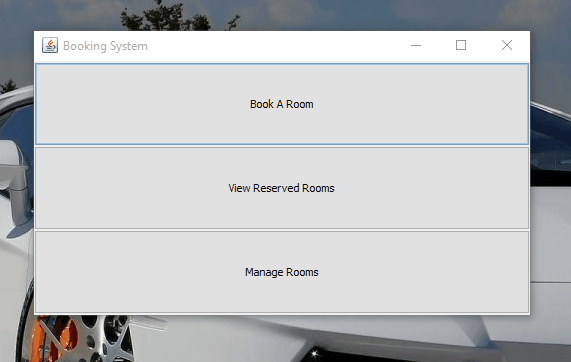
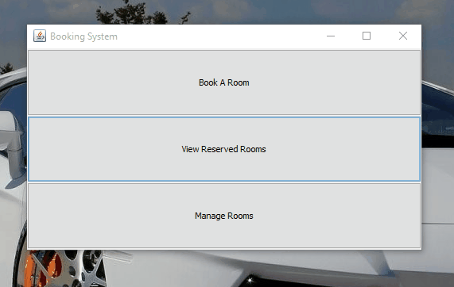

# Lab Booking/Management System
A Computer Laboratory Booking/Management System powered by Java(7) 

# Manage Lab Room

# Do Booking

# History
This is just another typical academic project you'd get on as your lab assignments. It was created back then 2011 we(was a group project) had to create a system which can manage laboratory bookings of different lab size and other requirements. The project is done using only FileSystem. No databases or nothing related to. Just pure FileWrite & Read. We didn't built the project by ourself only. took a great help from senior Java programmars back then.

# Use cases
Our instructor threw us a problem of having difficulties booking computer lab for our classes. Back then it was kind of manual process of choosing a lab-room for instructor. Different class have different requirements e.g. Lab capacity, OS requirement, working tools/software requirements, hardware configurations, class time etc. 

She suggested that it'd be nice if we can come up with a solution which can ease the process of booking these computer lab. The flow will be like that. 

Faculties will come to the lab operator and tell his/her requirements. E.g (I need a lab of 25 capacity which would have Linux OS with Netbeans. Class time could be anything between 8 a.m to 2 p.m). The lab operator will use this software, filter down requirements and book a room against faculty's name.

# Demo
You can always run the project executing the main function. The .jar is included with this repo and also have a pre populated dataset

# Issues
I have no intention to maintain this repo. Plus I also think there's anything to be added. You can play around as you want. The codebase is pretty much neat. Now I realize that the filter function doesn't have any `year` included. feel to free to upgrade as you want.
